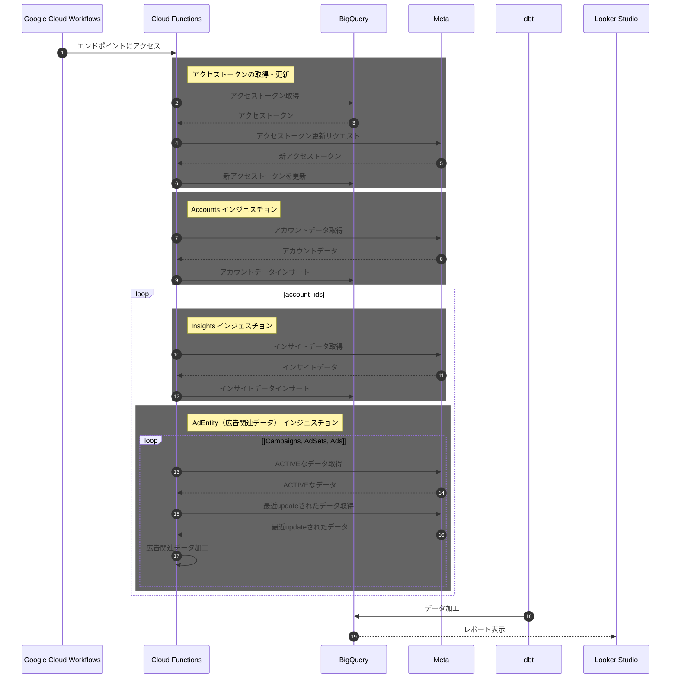

# プライバシーポリシー

弊チームが提供する Meta のデータ取得サービスについてのプライバシーポリシーです。

## 処理するデータの種類

1. 広告の insight データ

2. ad, adset, campaign のマスタデータ

3. ビジネスマネージャに紐づく account のマスタデータ

## 処理方法

## 処理の目的

取得したデータを用いて、Looker Studio でレポートを作成する。

## データ削除の依頼方法

n.hori@androots.co.jp にお問合せください。